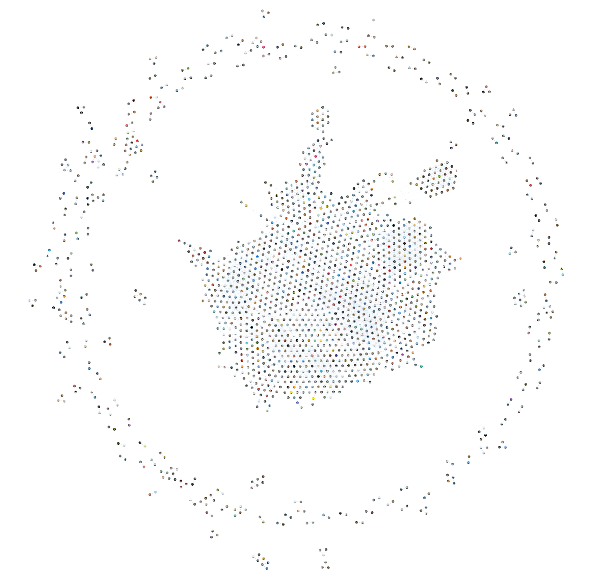
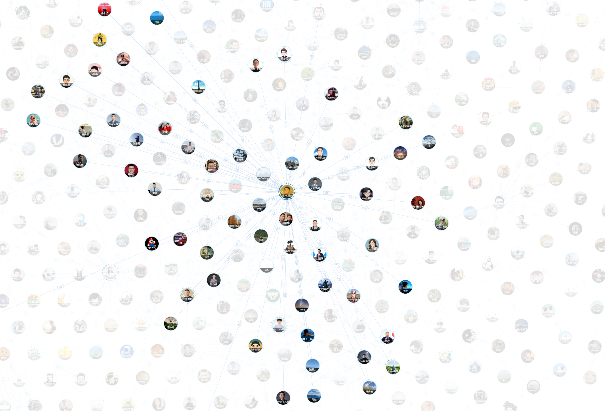

# [relation-chart](https://github.com/hanson/relation-chart)

人物关系图生成器 - 基于 D3.js 力导向图的可交互关系可视化组件

---

## 微信关系链示例





---

## 致谢

本项目 Fork 自 [xiedajian/relation-chart](https://github.com/xiedajian/relation-chart)，由 **hanson** 进行功能增强和维护，感谢原作者的开源贡献。

## 新增特性亮点

在原项目基础上，新增了以下功能和优化：

### 交互式工具栏
- **缩放控制** - 放大/缩小按钮，实时显示缩放比例
- **重置视图** - 一键恢复到初始状态
- **聚焦模式** - 持续高亮选中节点的关系网，鼠标移开不消失
- **节点搜索** - 搜索框支持按名称查找节点，显示关系数量

### 增强的高亮效果
- **分级透明度** - 直接关联节点清晰显示，无关节点淡化处理
- **聚焦状态锁定** - 点击节点后保持高亮，便于观察关系网络
- **目标节点强调** - 搜索定位的节点用红色边框标识

### 扩展的缩放范围
- 缩放范围从 `[0.5, 1.5]` 扩展至 `[0.01, 3]`
- 支持更大幅度的放大和缩小，适应不同规模的关系图

### 键盘导航
- 搜索结果支持 `↑` `↓` 箭头键导航
- `Enter` 键快速选择，`Esc` 键关闭搜索

### 新增配置项
```javascript
{
  showToolbar: true,           // 是否显示工具栏
  searchPlaceholder: '搜索节点...',  // 搜索框占位文字
  opacityLevels: {             // 透明度配置
    direct: 1,                 // 直接关联节点
    unrelated: 0.15,           // 无关节点
    normal: 1                  // 正常状态
  }
}
```

---

[效果预览链接](https://hanson.github.io/relation-chart/examples/demo1/index.html)


[预览](https://hanson.github.io/relation-chart/demo3.jpg)

可进行拖拽，缩放

[](https://hanson.github.io/relation-chart/examples/demo1/index.html)

高亮选中的节点

[](https://hanson.github.io/relation-chart/examples/demo1/index.html)

# install

npm:
```
npm install relation-chart --save
```

# 引用
ES6:
```javascript
import RelationChart from 'relation-chart'
```

Script tag:
```
// 引用 dist/dist.js 文件，注意自己项目的路径
<script src="./node_modules/relation-chart/dist/dist.js"></script>
```

# API
```
new RelationChart(domElement, data[, config])
```
参数说明：
- domElement：容器dom元素
- data：人物关系图的数据，格式见下文
- config：自定义配置，可省略，默认详细配置见下文


# 数据格式
```
{
    // 节点列表
    nodes:[
        {
            "name": "路人甲",
            "avatar": "./img/140646844806.jpg"
        },
        {
            "name": "路人乙",
            "avatar": "./img/141611471224.jpg"
        },
        {
            "name": "路人丙",
            "avatar": "./img/140848800133.jpg"
        },
    ],
    // 线条列表
    links:[
        {
            "source": 0,            // 起始节点在 nodes[] 中的索引
            "target": 1,            // 目标节点在 nodes[] 中的索引
            "relation": "朋友",      // 关系名称
            "color": "734646"       // 自定义细条颜色,#734646
        },
        {
            "source": 1,
            "target": 2,
            "relation": "女朋友",
            "color": "734646"
        },
    ],
}
```


# config

默认配置
```javascript
const defaultConfig = {
    width: 1000,                 // 总画布svg的宽,单位为px,默认为容器的宽
    height: 800,                // 高，默认为容器的高
    isHighLight: true,          // 是否启动 鼠标 hover 到节点上高亮与节点有关的节点，其他无关节点透明的功能
    isScale: true,              // 是否启用缩放平移zoom功能
    scaleExtent: [0.01, 3],     // 缩放的比例尺（扩展范围）
    chargeStrength: -300,       // 万有引力
    collide: 100,               // 碰撞力的大小 （节点之间的间距）
    nodeWidth: 160,             // 每个node节点所占的宽度，正方形
    margin: 20,                 // node节点距离父亲div的margin
    alphaDecay: 0.0228,         // 控制力学模拟衰减率
    r: 45,                      // 头像的半径 [30 - 45]
    relFontSize: 12,            // 关系文字字体大小
    linkSrc: 30,                // 划线时候的弧度
    linkColor: '#bad4ed',       // 链接线默认的颜色
    strokeColor: '#7ecef4',     // 头像外围包裹的颜色
    strokeWidth: 3,             // 头像外围包裹的宽度
    // ========== 新增配置 ==========
    showToolbar: true,          // 是否显示工具栏
    searchPlaceholder: '搜索节点...', // 搜索框占位文字
    opacityLevels: {            // 透明度配置
        direct: 1,              // 直接关联节点（1度关系）
        unrelated: 0.15,        // 无关系节点
        normal: 1               // 正常状态
    },
}
```
自定义配置会覆盖默认配置


# example

html 有个承载 svg 图的容器
```html
<div id="map" style="width: 1000px;height: 800px">
</div>
```

```javascript
import RelationChart from 'relation-chart'

// 容器
let element = document.querySelector('#map');

// 关系图数据

let data = {
    nodes: [
        {
            "name": "路人甲",
            "avatar": "./img/140646844806.jpg"
        },
        {
            "name": "路人乙",
            "avatar": "./img/141611471224.jpg"
        },
        {
            "name": "路人丙",
            "avatar": "./img/140848800133.jpg"
        },
    ],
    links: [
        {
            "source": 0,
            "target": 1,
            "relation": "朋友",
            "color": "734646"
        },
        {
            "source": 1,
            "target": 2,
            "relation": "女朋友",
            "color": "734646"
        },
    ],
}

// 创建人物关系图 svg
new RelationChart(element, data)
```


# vue 中使用案例

```html
<template>
  <div class="page">
    <div id="map" class="map" ref="map" style="width: 1000px;height: 1000px;">
    </div>
  </div>
</template>
```
```html
<script>
import RelationChart from 'relation-chart'

export default {
  data () {
    return {}
  },
  mounted() {
    new RelationChart(this.$refs.map, data)
  },
}
</script>
```

[欢迎 star ❤❤❤](https://github.com/hanson/relation-chart)
